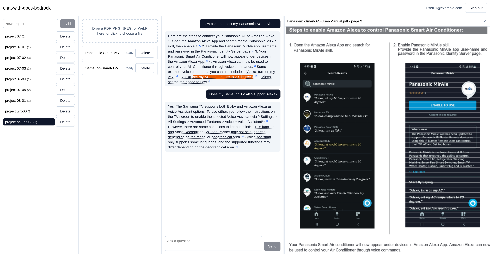
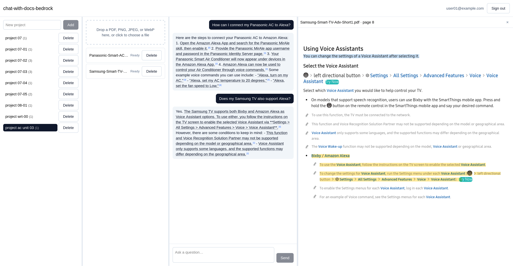

# chat-with-docs-bedrock

> The content of this repository was co-created by Claude Sonnet 4.6 and Claude Opus 4.6.

Serverless chat-with-your-docs (PDFs, images) app that utilizes `nova-2-multimodal-embeddings`
(Amazon Bedrock). Upload PDFs and images into a project, then ask questions and get answers
whose every claim is anchored to the exact sentences it came from — highlighted in place in
the source document.

- **Multi-document projects.** Unlike most single-PDF chat demos, a project holds many files -
  one conversation can draw its answer, and citations, from more than one document at once.
- **Grounded answers.** Generation uses Anthropic's Citations API, so citations are produced
  by the model as structured spans rather than parsed out of prose.
- **Multimodal retrieval.** Text passages *and* rendered page images are embedded with Amazon
  Nova Multimodal Embeddings, so charts, diagrams and scans are retrievable.
- **AWS Serverless.** No servers, no containers to keep warm, no VPC. Everything is Lambda,
  Step Functions, DynamoDB, S3, S3 Vectors, and AppSync Events.





## Stack at a glance

| Layer | Choice |
| --- | --- |
| Frontend | React 19 + TypeScript 6.0 + Vite, Tailwind + shadcn/ui, `pdf.js` |
| Hosting | S3 + CloudFront (OAC) |
| Auth | Cognito user pool + Managed Login (hosted UI), OIDC in the SPA |
| API | API Gateway HTTP API + JWT authorizer → Lambda (Python 3.12) |
| Real-time | AppSync Events API (WebSocket pub/sub, Cognito-authorized) |
| Async | SQS + Lambda (answering), Step Functions Standard (ingestion) |
| Storage | S3, DynamoDB (single table) |
| Vectors | Amazon S3 Vectors, one index per project |
| Embeddings | `amazon.nova-2-multimodal-embeddings-v1:0` on Bedrock |
| Generation | `anthropic.claude-sonnet-4-6` on Bedrock, Citations API |
| Rewriting | `anthropic.claude-haiku-4-5` on Bedrock |
| OCR | Amazon Textract |
| Safety | Amazon Bedrock Guardrails (`ApplyGuardrail`) on input and output |
| IaC | AWS CDK v2 (TypeScript 6.0, npm) |
| Backend deps | uv workspace (Python 3.12) |
| Testing | pytest, vitest, Playwright (chromium + webkit) |

## Architecture

```
┌─────────────────────────────────────────────────────────────────────────┐
│ Browser: React 19 SPA (Vite, Tailwind, pdf.js viewer)                   │
└───────┬──────────────────┬──────────────────┬──────────────────┬────────┘
        │ site assets      │ OIDC + PKCE      │ JWT              │ WSS + JWT
        ▼                  ▼                  ▼                  ▼
┌────────────────┐ ┌────────────────┐ ┌────────────────┐ ┌────────────────┐
│ CloudFront     │ │ Cognito        │ │ API Gateway    │ │ AppSync Events │
│ + OAC          │ │ user pool      │ │ HTTP API       │ │ WebSocket      │
│ S3: SPA bundle │ │ Managed Login  │ │ JWT authorizer │ │ pub/sub        │
└────────────────┘ └────────────────┘ └───────┴────────┘ └───────┴────────┘
                                              │                  └───────────┐
                                              ▼              publish (SigV4) │
                                   ┌──────────┬───────────┐                  │
                                   │ Lambda: api          │                  │
                                   │ control plane only   │                  │
                                   │ no Bedrock access    │                  │
                                   └─────┬──────────┬─────┘                  │
                ┌────────────────────────┘          └────┐                   │
                │ StartExecution                         │ enqueue           │
                ▼                                        ▼                   │
┌───────────────┬────────────────┐       ┌───────────────┬────────────────┐  │
│ Step Functions (Standard)      │       │ SQS: answer-queue + DLQ        │  │
│ probe -> page -> chunk -> embed│       │ -> Lambda: answering           │  │
│ -> finalize, Textract OCR      │       │ rewrite -> retrieve -> generate│  │
└───────────────┴────────────────┘       └───────────────┴────────────────┘  │
                ├────────────────────────────────────────┼───────────────────┘
                │                                        │
        ┌───────┴──────────┬──────────────────┬──────────┴───────┐
        ▼                  ▼                  ▼                  ▼
┌───────┬────────┐ ┌───────┬────────┐ ┌───────┬────────┐ ┌───────┬────────┐
│ DynamoDB       │ │ S3: documents  │ │ S3 Vectors     │ │ Bedrock: Nova  │
│ single table   │ │ raw + renders  │ │ one index per  │ │ Haiku, Sonnet  │
│ citation maps  │ │ artifacts      │ │ project        │ │ (Citations API)│
└────────────────┘ └────────────────┘ └────────────────┘ └────────────────┘
```

Full component responsibilities and request-flow sequence diagrams live in
[docs/01-architecture.md](docs/01-architecture.md).

## Documentation

| Doc | Contents |
| --- | --- |
| [00-overview.md](docs/00-overview.md) | Product scope, users, non-goals, glossary |
| [01-architecture.md](docs/01-architecture.md) | Components, request flows, AWS inventory |
| [02-data-model.md](docs/02-data-model.md) | DynamoDB single table, S3 layout, vector index |
| [03-ingestion.md](docs/03-ingestion.md) | Step Functions ingestion pipeline |
| [04-retrieval-and-citations.md](docs/04-retrieval-and-citations.md) | Retrieval, prompt assembly, citation mapping |
| [05-api-contracts.md](docs/05-api-contracts.md) | HTTP API and AppSync Events contracts |
| [06-frontend.md](docs/06-frontend.md) | SPA structure, pdf.js viewer, highlighting |
| [07-security.md](docs/07-security.md) | Auth, IAM, guardrails, tenancy |
| [08-testing.md](docs/08-testing.md) | Unit / integration / e2e strategy |
| [09-operations.md](docs/09-operations.md) | Deployment, observability, cost, runbooks |
| [10-roadmap.md](docs/10-roadmap.md) | **Implementation roadmap** |

## Quick start

Prerequisites are listed in [docs/10-roadmap.md § Human prerequisites](docs/10-roadmap.md#human-prerequisites).
In short: Python 3.12 + [uv](https://docs.astral.sh/uv/), Node 22 + npm, Docker, the AWS CLI
with credentials for a sandbox account, and Bedrock model access enabled for Claude Sonnet 4.6,
Claude Haiku 4.5, and Nova Multimodal Embeddings.

```bash
# Backend
uv sync
uv run pytest

# Infrastructure
cd infra && npm ci && npm test

# Frontend
cd web && npm ci && npm run dev

# Deploy the dev stack (run by a human — see docs/09-operations.md)
cd infra && npx cdk deploy --all --context env=dev
```

## Repository layout

```
.
├── docs/                  Project documentation
├── infra/                 AWS CDK v2 app (TypeScript)
├── services/              Python 3.12 Lambda packages (uv workspace members)
│   ├── common/            Shared models, DynamoDB access, Bedrock clients
│   ├── api/               HTTP API handlers
│   ├── ingestion/         Step Functions task handlers
│   └── answering/         SQS worker: rewrite → retrieve → generate → stream
├── web/                   React SPA
├── e2e/                   Playwright specs and docker-compose harness
└── pyproject.toml         uv workspace root
```

## Limitations

I do not recommend deploying this project as a publicly exposed service, deploy it only for
testing or internal/personal use. Currently hardrening and polish stages have not been
implemented. Here are some of the existing limitations:

- **Guardrails and prompt injection.** Bedrock Guardrails are not wired up on input or output,
  so there is no automated defense against unsafe content or prompt injection yet.
- **Rate limiting, resilience, and cost controls.** No per-user rate limits, reserved Lambda
  concurrency, DLQ failure handling, alarms, or cost dashboards exist yet.
