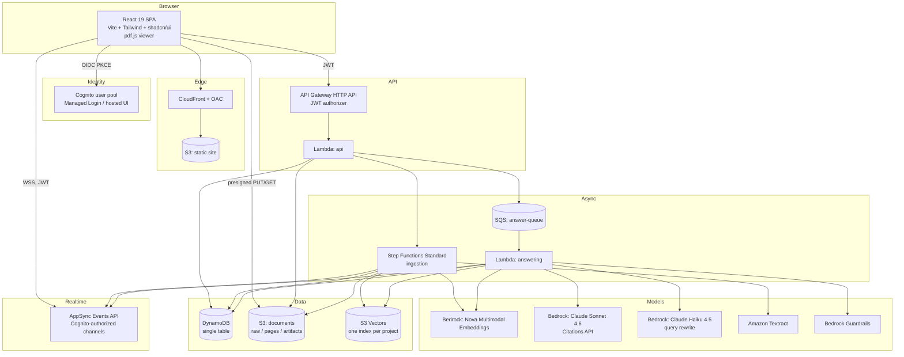
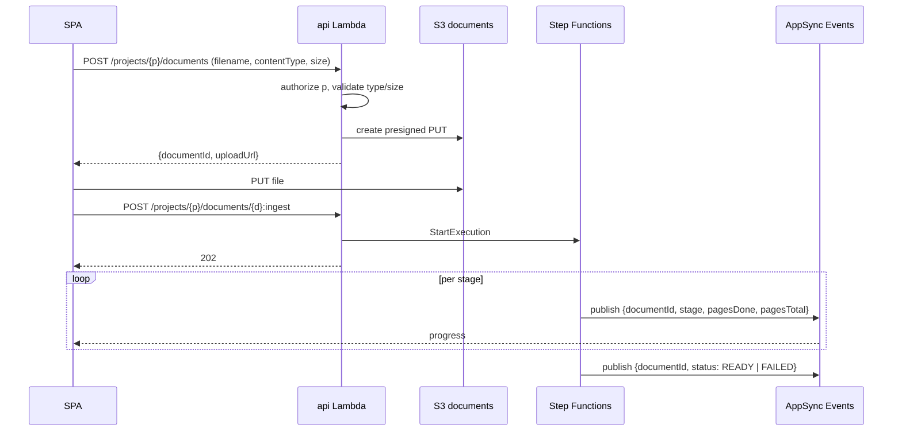
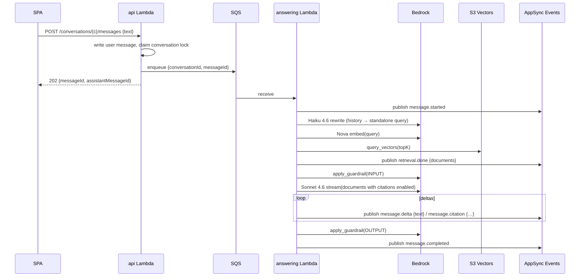

# 01 — Architecture

## System diagram

## Component responsibilities

### Frontend (S3 + CloudFront)

A static React SPA. CloudFront serves it with Origin Access Control over a private bucket;
`/index.html` is the SPA fallback for 403/404. The browser never receives AWS credentials —
there is no Cognito identity pool. It holds a Cognito ID/access token pair and uses it for
three things: the HTTP API, the AppSync Events WebSocket, and nothing else. All S3 access is
via short-lived presigned URLs minted by the API.

### Cognito

A user pool with Managed Login (the hosted UI). Authorization code flow with PKCE, no client
secret. The SPA is a public OIDC client. Tokens are held in memory with a refresh token in a
secure, `SameSite=Strict` cookie scope managed by the OIDC library; see
[07-security.md](07-security.md#token-handling).

### HTTP API + `api` Lambda

API Gateway HTTP API with a built-in JWT authorizer pointed at the user pool. One Python 3.12
Lambda behind it, routed internally (a small dispatch layer, not a web framework). It is
strictly a control-plane function: reads and writes DynamoDB, mints presigned S3 URLs, starts
Step Functions executions, and enqueues answer jobs. It never calls Bedrock and never blocks
on long work — every request should return in well under a second.

### Ingestion (Step Functions Standard)

One execution per uploaded document. Standard (not Express) because executions can run for
minutes on large PDFs, need full execution history for debugging, and use a Distributed Map
over pages. Detailed in [03-ingestion.md](03-ingestion.md).

### Answering (SQS + `answering` Lambda)

Posting a message returns `202` immediately after writing the user message to DynamoDB and
enqueuing a job. The worker Lambda does the whole answer turn: query rewrite, retrieval,
guardrail check, generation with streaming, citation mapping, persistence, and publishing to
AppSync Events. Detailed in [04-retrieval-and-citations.md](04-retrieval-and-citations.md).

The queue is a standard SQS queue with a redrive policy to a DLQ after 2 receives. Ordering
within a conversation is enforced by an optimistic lock on the conversation item rather than
by FIFO, because the failure mode we care about (two concurrent answers in one conversation)
is better handled by rejecting the second than by serialising it behind a slow first.

### AppSync Events API

Pub/sub over WebSocket, authorized with the same Cognito user pool. The SPA subscribes to
`/conversations/{conversationId}` for answer streaming and `/projects/{projectId}` for
ingestion progress. Backend Lambdas publish over HTTP (`POST /event`) with IAM SigV4. Channel
authorization is enforced by an AppSync channel-namespace handler that checks the caller's
`sub` against the resource owner — see [07-security.md](07-security.md#channel-authorization).

### Data stores

- **DynamoDB**, one table, on-demand billing. Holds users, projects, documents, page
  metadata, **chunk-to-sentence-to-bbox maps**, conversations, and messages. The chunk map is
  the source of truth for turning a model citation into a highlight rectangle.
- **S3 (documents bucket)**, one bucket, prefix-partitioned. Originals, page renders at two
  resolutions, and JSON extraction artifacts.
- **S3 Vectors**, one vector bucket per environment, **one index per project**. Metadata
  filtering scopes queries to a document when the user pins one; otherwise the whole project
  index is queried.

### Models

All model access is Bedrock, in one region, via IAM. No API keys anywhere in the system.

| Purpose | Model | Client |
| --- | --- | --- |
| Answer generation with citations | `anthropic.claude-sonnet-4-6` | `AnthropicBedrockMantle` (`anthropic[bedrock]`) |
| Follow-up query rewriting | `anthropic.claude-haiku-4-5` | `AnthropicBedrockMantle` |
| Text and image embeddings | `amazon.nova-2-multimodal-embeddings-v1:0` | `boto3` `bedrock-runtime.invoke_model` |
| OCR | Amazon Textract | `boto3` `textract` |
| Safety | Bedrock Guardrails | `boto3` `bedrock-runtime.apply_guardrail` |

> **Verify before Phase 4.** Bedrock frequently requires a regional inference-profile prefix
> (e.g. `us.anthropic.claude-sonnet-4-6`) rather than the bare `anthropic.`-prefixed id, and
> the Nova embeddings request/response body shape is not assumed anywhere in these docs. Both
> are pinned behind adapters (`services/common/bedrock/`) and confirmed by a live smoke test
> in Phase 0. See [10-roadmap.md](10-roadmap.md#phase-0--scaffolding-and-toolchain).

#### Bedrock feature notes that shape the design

- **Citations is supported on Bedrock.** This is the load-bearing assumption of the whole
  product and is smoke-tested in Phase 0 before anything else is built.
- **Automatic prompt caching is not available on Bedrock.** Caching requires explicit
  `cache_control` blocks, and Sonnet 4.6's minimum cacheable prefix is 1024 tokens. Our
  system prompt alone is unlikely to clear that bar and the document set changes every turn,
  so caching is treated as a measured optimisation in Phase 8, not a design assumption.
- **Citations is incompatible with structured outputs.** `output_config.format` returns a 400
  when `citations` is enabled, so the answer is plain text plus citation blocks. Anything we
  need in structured form (the rewritten query) is a *separate* call.
- **Assistant prefill returns 400 on Sonnet 4.6.** Response shaping is done with the system
  prompt only.
- **Adaptive thinking**, not `budget_tokens`. Sonnet 4.6 supports `effort` at
  `low`/`medium`/`high`/`max` (no `xhigh`).

## Request flows

### Upload and ingest

The client-driven two-step (`create` then `:ingest`) is deliberate: it means an abandoned
upload leaves a `PENDING` DynamoDB row and an orphan S3 object cleaned up by a lifecycle rule,
rather than a half-run state machine. S3 event notifications are *not* used to trigger
ingestion, because they cannot carry the project/document identity we need without a lookup
and they fire for artifacts the pipeline itself writes.

### Ask a question

## Compute packaging

All Python Lambdas are **container images on arm64**, built from one shared base image
(`services/Dockerfile`) with dependencies installed by uv, each function selecting its own
handler via `CMD`. Rationale:

- PyMuPDF and Pillow are large native wheels; zip bundling for them is fragile.
- One image, one dependency resolution, one lockfile — a mixed zip/image setup means two ways
  to be wrong about dependencies.
- arm64 (Graviton) is cheaper per GB-second and every dependency in the stack has arm64 wheels.

The cost is a Docker build in the deploy loop and slightly larger cold starts. This is
acceptable: the API Lambda is the only latency-sensitive one, and its cold start is dominated
by boto3 import either way.

> Requires Docker on the machine running `cdk deploy` and `cdk synth` for image assets.

| Function | Memory | Timeout | Notes |
| --- | --- | --- | --- |
| `api` | 512 MB | 10 s | Provisioned concurrency deliberately *not* used; revisit if p95 hurts. |
| `ingest-probe` | 1024 MB | 60 s | Opens the PDF, classifies pages. |
| `ingest-page` | 2048 MB | 120 s | Render + extract + OCR for one page. Memory buys CPU for rasterisation. |
| `ingest-chunk` | 1024 MB | 120 s | Sentence segmentation and chunk assembly. |
| `ingest-embed` | 1024 MB | 300 s | Batched Nova calls; network-bound. |
| `ingest-finalize` | 512 MB | 60 s | Status flip, event publish. |
| `answering` | 2048 MB | 300 s | Long-lived streaming; timeout well above worst-case generation. |

## Environments

One environment, `dev`, deployed manually by a human with `npx cdk deploy`. The CDK app is
parameterised by `-c env=<name>` from the start and every resource name is suffixed with it,
so adding `prod` later is a context value and a second deploy — not a refactor. Initially,
there is no CI/CD pipeline; GitLab CI pipeline will be considered after Phase 4.

## What is deliberately absent

- **No VPC.** Nothing needs private networking; adding one would mean NAT costs and
  cold-start penalties for zero benefit.
- **No API framework** (FastAPI/Powertools event handler is used only for routing and
  parsing, not as a server). Cold start matters more than ergonomics at this size.
- **No OpenSearch / Aurora pgvector.** S3 Vectors is chosen precisely because per-project
  indexes are cheap to create and destroy and zero-cost at idle.
- **No Bedrock Knowledge Bases.** We need control over chunk boundaries and sentence-level
  geometry, which a managed RAG pipeline does not surface.
