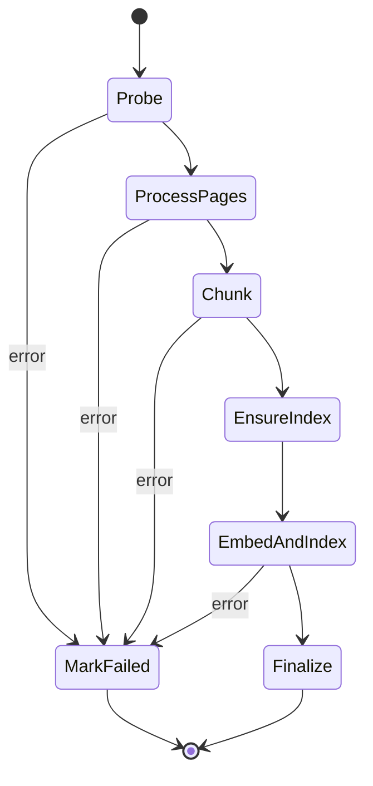

# 03 — Ingestion pipeline

One Step Functions **Standard** execution per document, started by the `api` Lambda when the
client calls `POST /projects/{p}/documents/{d}:ingest`. Standard rather than Express because
a 500-page PDF can exceed five minutes, we want full execution history for debugging, and we
use a Distributed Map.

## State machine



`ProcessPages` is a **Distributed Map** over page numbers, `MaxConcurrency: 20`, with each
iteration running `ingest-page`. `EmbedAndIndex` is an inline Map over batches of chunks.

State passed between steps is always small — S3 keys and counts, never page content. The
Distributed Map reads its item list from `artifacts/{p}/{d}/probe.json` in S3 rather than from
the state payload, so page count is not bounded by the 256 KB state limit.

Every state has `Retry` on `States.TaskFailed`/`Lambda.ServiceException`/`Lambda.TooManyRequestsException`
with exponential backoff (2 s base, 2× rate, 4 attempts) and a `Catch` to `MarkFailed`.

## Step 1 — `Probe`

**Input:** `{projectId, documentId, s3Key, contentType}`

1. Download the source object to `/tmp`.
2. Verify the declared content type against magic bytes. A mismatch fails the document with a
   clear message rather than proceeding.
3. **Images** (`image/png`, `image/jpeg`, `image/webp`): treat as a one-page document.
   `pageCount = 1`, `textSource = "textract"` unconditionally — an uploaded picture has no
   text layer by definition.
4. **PDFs**: open with PyMuPDF. For each page record `width`, `height`, `rotation`, and a
   **text-density** score:

   ```
   textDensity = (chars extracted by get_text("text")) / max(1, pageArea in in² × 250)
   ```

   250 characters per square inch is roughly a sparse typeset page. The score is clamped to
   `[0, 1]`.

   - `textDensity ≥ 0.15` → `textSource = "pdf"`
   - `textDensity < 0.15` → `textSource = "textract"`

   The threshold catches the common mixed case: a born-digital PDF where three pages are
   inserted scans. It is a constant in `services/ingestion/probe.py` with a fixture-driven
   test over the sample corpus, because it *will* need tuning.

5. Reject documents over the configured limits (default: 1000 pages, 200 MB). Limits live in
   `services/common/config.py` and are surfaced to the client at upload time so rejection
   happens before the bytes move, not after.
6. Write `artifacts/{p}/{d}/probe.json`, write Page items to DynamoDB, set document status
   `PROCESSING`, publish an ingestion event.

**Output:** `{pageCount, ocrPageCount, probeKey}`

## Step 2 — `ProcessPages` (Distributed Map → `ingest-page`)

One invocation per page. Each does three things.

### 2a. Render

Two renders per page, both written to S3:

| Render | Purpose | Spec |
| --- | --- | --- |
| `{page:04d}.png` | Viewer fallback and debugging | ~200 DPI, capped at 3000 px on the long edge |
| `{page:04d}.embed.jpg` | Nova embedding, Textract OCR, and any VLM inspection | JPEG q85, **long edge ≤ 1568 px** |

The 1568 px cap is Claude's vision resolution ceiling for this model tier — going above it
buys nothing and costs image tokens. Nova has its own input constraints (confirmed in the
Phase 0 smoke test); if Nova's limit is lower, the embed render is sized to the *smaller* of
the two and the constant is updated in one place.

For image documents the "render" is a re-encode: strip EXIF, apply EXIF rotation, convert to
sRGB, and produce the same two outputs.

### 2b. Extract text with geometry

**When `textSource == "pdf"`:** `page.get_text("dict")` gives blocks → lines → spans, each
with a bbox. We keep **lines**, not blocks — a block can span a whole column, and line-level
boxes are what make sentence highlighting look right. Each line is normalised into the
canonical coordinate system (see [02-data-model.md](02-data-model.md#coordinate-systems)),
including the rotation correction.

**When `textSource == "textract"`:** call `textract:DetectDocumentText` **synchronously** on
the `.embed.jpg` render for that single page.

> This is a refinement of the original plan to use the async Textract job API.
> `DetectDocumentText` is synchronous, accepts a single-page PNG/JPEG up to 10 MB, and we
> already produce exactly that render inside a per-page Map state. Using it removes the
> `StartDocumentTextDetection` → SNS → poll plumbing entirely and parallelises for free.
> The async path (`StartDocumentTextDetection` over the whole PDF) is kept in mind as a
> fallback if we hit Textract's per-second sync quota on very large documents; the switch is
> local to `services/ingestion/ocr.py`.

Textract `LINE` blocks are used, with `Geometry.BoundingBox` converted from normalised
`[0,1]` image coordinates to canonical PDF points. `WORD` blocks are also retained in the
artifact, unused for now, but they are what a future word-level highlight mode would need and
they cost nothing extra to store.

Textract calls are wrapped in retry-with-jitter on `ThrottlingException` and
`ProvisionedThroughputExceededException`. Distributed Map concurrency (20) is the throttle
knob; if OCR-heavy documents trip Textract limits, lower it before adding client-side
rate limiting.

### 2c. Persist

Append one JSON line per page to `artifacts/{p}/{d}/blocks.jsonl` — actually written as one
object per page (`blocks/{page:04d}.json`) and concatenated in the next step, because
Distributed Map iterations cannot safely append to a shared object.

```jsonc
{
  "pageNumber": 7,
  "width": 612.0, "height": 792.0,
  "textSource": "pdf",
  "lines": [
    { "text": "The facility achieved 94% uptime in Q3.",
      "rect": [72.0, 640.2, 511.4, 655.8] }
  ]
}
```

Update the Page item with `textSource` and the render keys. Publish a progress event every
10 pages (not every page — a 500-page document would otherwise emit 500 WebSocket messages).

## Step 3 — `Chunk`

Reads all per-page block files, produces `artifacts/{p}/{d}/chunks.jsonl` and the Chunk items
in DynamoDB.

### Reading order

Lines are sorted into reading order before segmentation: cluster by column (x-overlap
projection), then top-to-bottom within a column. Naïve top-to-bottom sorting mangles
two-column layouts, which are common in the target corpus.

### Sentence segmentation

Segmentation is done on the **joined line text of a page**, then mapped back to line rects:

1. Join lines with a space, healing hyphenated line breaks (`compre-\nhensive` → `comprehensive`).
2. Track, for each output character, which source line it came from.
3. Segment with a rules-based splitter (`pysbd` or equivalent). No ML sentence splitter: cost and
   cold start are not worth the marginal accuracy here.
4. For each sentence, `rects` = the boxes of every line it touches, each clipped horizontally
   to the sentence's extent when the sentence starts or ends mid-line. Clipping is
   proportional to character position within the line — approximate, but visually correct in
   the overwhelming majority of cases, and cheap.

A sentence never spans a page boundary. A sentence longer than 1000 characters (a table row,
a mangled scan) is hard-split at 1000 characters so that one bad sentence cannot swallow a
whole chunk.

### Chunking

- Chunks never cross page boundaries. This is what makes `pageNumber` a property of the chunk
  and keeps citation → page resolution trivial.
- Target **400–600 tokens** per chunk (estimated at 4 characters/token), hard cap 900.
- One sentence of overlap between consecutive chunks on the same page.
- A page with fewer than 20 characters of text produces **no** text chunk — only its page
  vector. Blank pages and full-bleed images should not pollute the text index.
- Chunk items are capped at 300 KB; a chunk that would exceed it is split regardless of token
  targets.

## Step 4 — `EnsureIndex`

Idempotently create the project's S3 Vectors index `proj-{projectId}` if absent, asserting the
dimension matches `EMBED_DIM` and registering `preview` as a non-filterable metadata key. On
`ConflictException`/already-exists, continue.

## Step 5 — `EmbedAndIndex`

Two vector families go into the same index, distinguished by `kind` metadata.

| `kind` | One vector per | Nova input | Key |
| --- | --- | --- | --- |
| `text` | chunk | chunk text | `{documentId}:{chunkId}` |
| `page` | page | the `.embed.jpg` render | `{documentId}:p{page:04d}` |

Rationale for both: text chunks give precise, citable retrieval for prose; page vectors give
recall on figures, charts, layout-heavy pages, and scans whose OCR is poor. The retrieval side
fuses them and only ever *cites* text chunks — see
[04-retrieval-and-citations.md](04-retrieval-and-citations.md#fusion-and-selection).

Implementation notes:

- Embedding calls are batched (batch size pinned in Phase 4 after confirming Nova's limits),
  issued with bounded concurrency, and retried on throttling with jitter.
- Text and page embeddings must come from the **same** Nova model and output dimension so
  they share a vector space and can be compared against one query embedding. This is the
  entire reason for choosing a multimodal embedding model.
- `put_vectors` batches are 1:1 with embedding batches; a partial failure retries the whole
  batch (keys are deterministic, so writes are idempotent).
- Vectors for the document are deleted before writing on a re-ingest.

## Step 6 — `Finalize`

Update the Document item: `status = READY`, `pageCount`, `chunkCount`, `ocrPages`,
`ingestion.finishedAt`. Increment the project's `documentCount` and `chunkCount` with an
atomic `ADD`. Publish `document.ready` on the project channel.

## Failure handling — `MarkFailed`

Sets `status = FAILED` with a `statusDetail` written for a human ("Textract throttled after 4
attempts on page 12", "Encrypted PDF: password required", "Page count 1420 exceeds the 1000
page limit"). Publishes `document.failed`. Partial artifacts and partial vectors are left in
place; the retry path is a full re-ingest, which deletes them first.

Re-ingest is exposed as `POST /projects/{p}/documents/{d}:ingest` on a document already in
`FAILED` or `READY` — same endpoint, idempotent by design.

## Known failure modes and how they surface

| Case | Behaviour |
| --- | --- |
| Encrypted / password-protected PDF | Fails at `Probe` with an explicit message |
| Corrupt PDF that PyMuPDF partially opens | Pages that fail to render are recorded with `textSource: "none"`; the document completes with a warning count |
| Pure-image PDF with unreadable handwriting | Textract returns little; the page gets no text chunk but does get a page vector, so it is still retrievable visually |
| A page that is one giant table | Lines are extracted; sentence segmentation produces long "sentences"; highlighting is coarse but correct. Accepted for now. |
| Non-Latin scripts | PyMuPDF extraction works; Textract language support is a per-language question. Out of scope until it comes up. |
| Duplicate upload (same sha256, same project) | Allowed. Deduplication is a future optimisation, not a correctness issue. |

## Performance targets

| Document | Target wall-clock |
| --- | --- |
| 50-page text-layer PDF | ≤ 2 min |
| 50-page scanned PDF (all OCR) | ≤ 5 min |
| Single image | ≤ 20 s |
| 500-page text-layer PDF | ≤ 12 min |

Dominated by page-level fan-out; the tuning knob is Distributed Map `MaxConcurrency`, bounded
by Textract and Bedrock quotas rather than by Lambda.
